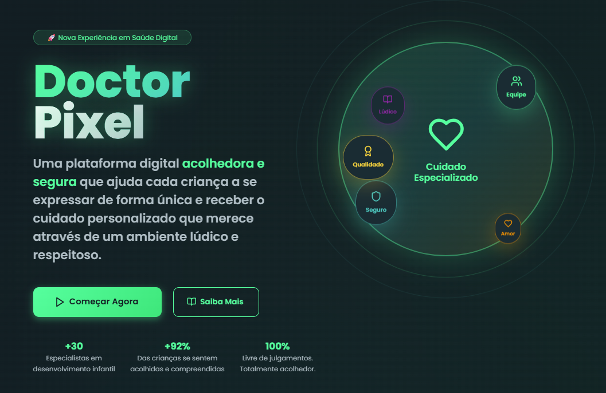

# 🧠 Projeto [Doctor Pixel]

## 👥 Equipe: 28 - BYTCHÊ

### 👨‍💻 Integrantes

| Nome completo       | Função no Projeto                  |
|---------------------|------------------------------------|
| Luan Vieira     | Tech Lead              |
| Murilo Leal     | Desenvolvedor Frontend            |
| Kevin Lopes     | Desenvolvedor Backend                     |
| Jocimar Rodrigues      | Desenvolvedor FullStack  |
| Walisson Camargo          | UX/UI Designer           |

---

## 🧭 Tema / Área

Avaliação pediátrica digital com foco em **avaliação psicológica e neurodesenvolvimental**, visando apoiar crianças (inclusive com TEA - Transtorno do Espectro Autista) em consultas iniciais através de tecnologia empática e acessível.

---

## ❗ O Problema

A triagem tradicional em saúde pediátrica, especialmente voltada para aspectos emocionais e comportamentais, **depende fortemente da presença de responsáveis** e de profissionais altamente especializados. Isso pode gerar **dificuldades na escuta ativa da criança**, atrasos no diagnóstico e **subnotificação de sinais importantes de sofrimento ou neurodivergência**.

---


## 💡 A Solução Proposta

Desenvolvemos um **assistente virtual empático**, com linguagem adaptada para crianças, que conduz uma **triagem inicial interativa**. A IA realiza perguntas acolhedoras, mapeia sintomas e comportamentos, e gera um **relatório estruturado para avaliação médica/psicológica posterior**.

A solução se fundamenta em **teorias cognitivas e pedagógicas** que valorizam a escuta ativa da criança como sujeito do próprio processo de comunicação e desenvolvimento. Segundo David Ausubel, a **aprendizagem significativa** ocorre quando novas informações se conectam de maneira não arbitrária e substantiva ao conhecimento pré-existente. Aplicamos esse princípio ao criar interações que partem da linguagem e da **REALIDADE** da criança, promovendo maior engajamento e autenticidade nas respostas.

**Além disso, nos apoiamos em:**

- **Lev Vygotsky**, ao considerar a importância da mediação simbólica e da linguagem como ferramenta de expressão do pensamento infantil;

- **Carl Rogers**, cuja abordagem centrada na pessoa nos inspira a acolher as falas da criança sem julgamentos, com empatia e autenticidade;

- As **diretrizes da psicologia do desenvolvimento infantil**, que ressaltam a importância de escutar a criança em ambientes seguros e adaptados às suas capacidades comunicativas, especialmente em casos de crianças neurodivergentes (como TEA e TDAH).

**Este projeto visa:**

- Facilitar a escuta direta da criança.
- Acelerar a identificação de sinais de alerta.
- Apoiar diagnósticos precoces de condições como autismo, TDAH e transtornos emocionais.
- Auxiliar profissionais da saúde com dados estruturados e linguagem clínica.

---

## 🛠️ Tecnologias Utilizadas

| Categoria               | Ferramentas / Tecnologias            |
|------------------------|--------------------------------------|
| Backend      | TypeScript / Node.js        |
| API de IA              | OpenAI GPT-4o                        |
| Comunicação           | REST e WebSockets                 |
| Frontend          | React / NextJS                           |
| Banco de Dados         | PostgreSQL |

---

## 🚀 Instruções de Instalação e Execução

### ✅ Pré-requisitos

- Node.js 18+
- NPM ou Yarn
- Conta na OpenAI com chave de API válida

---

### 📦 1. Clone o repositório

```bash
git clone https://github.com/luan-vieira-er/28-BYTCHE
cd 28-BYTCHE
```

### 📥 2. Instale as dependências no frontend e backend

```bash
#/backend
npm install

#/frontend
npm install
```

### ⚙️ 3. Configure as variáveis de ambiente
Crie um arquivo .env na raiz do projeto com o seguinte conteúdo:

```bash
OPENAI_API_KEY=sk-xxxxx...
PORT=3000
```
### ▶️ 4. Execute o projeto localmente (json server, backend e frontend)

```bash
#/backend -- banco de dados
npx json-server ./db.json

#/backend
npm run dev

#/frontend
npm run dev
```

O banco de dados json estará disponível em:
📍 http://localhost:3000

O backend estará disponível em:
📍 http://localhost:3001

O frontend estará disponível em:
📍 http://localhost:3002

### 📄 Licença
**Este projeto foi feito durante o Code Race 2025.**

Os autores agradecem enormemente a organização por esse evento incrível.

Para uso comercial, entre em contato com os autores.

### 💬 Contato
Em caso de dúvidas ou sugestões, entre em contato com qualquer membro da equipe ou envie um e-mail para:
📧 [luanvieira.er@hotmail.com]